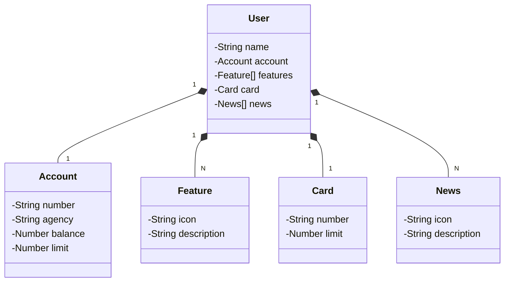

# Santander Dev Week 2023 Java API

RESTful API da Santander Dev Week 2023 construída em Java 17 com Spring Boot 3.

## Principais Tecnologias
 - **Java 17**: Versão LTS mais recente do Java com as últimas inovações que essa linguagem robusta oferece
 - **Spring Boot 3**: Versão mais atual do Spring Boot com a poderosa premissa de autoconfiguração;
 - **Spring Data JPA**: Simplifica camada de acesso aos dados, facilitando a integração com bancos de dados SQL;
 - **OpenAPI (Swagger)**: Simplifica documentação de API usando a OpenAPI (Swagger), perfeitamente;
 - **Railway**: Deploy e monitoramento de nossas soluções na nuvem, oferece diversos bancos de dados como serviço e pipelines de CI/CD.

## [Link do Figma](https://www.figma.com/file/KJcCh69TXrVqPihYiTy66a/SANTANDER---Projeto-Web%2FMobile?type=design&node-id=2%3A92&mode=design&t=3p44EGgCnYdfDJ2q-1)

<iframe style="border: 1px solid rgba(0, 0, 0, 0.1);" width="800" height="450" src="https://www.figma.com/embed?embed_host=share&url=https%3A%2F%2Fwww.figma.com%2Ffile%2FKJcCh69TXrVqPihYiTy66a%2FSANTANDER---Projeto-Web%252FMobile%3Ftype%3Ddesign%26node-id%3D2%253A92%26mode%3Ddesign%26t%3D3p44EGgCnYdfDJ2q-1" allowfullscreen></iframe>

O Figma foi utilizado para a abstração do domínio desta API, sendo útil na análise e projeto da solução.

## Diagrama de Classes (Domínio da API)

## Documentação da API (Swagger)

### 

### IMPORTANTE
